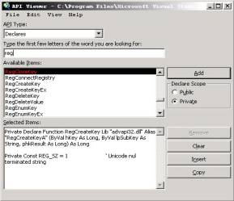



## \_A Great Registry Tutorial

### Description

This is a complete tutorial on the registry and registry API. It goes over buffers, intro to API, registry API, and comes with source code and screenshots. Use this if you have no clue! KEYWORDS: Registry REGISTRY API Save SAVE tutorial Tutorial TUTORIAL Accessing ACCESSING Jaime Miscatelli
 
### More Info
 

             |
---                |---
**Submitted On**   |2002-06-28 18:38:24
**By**             |[Jaime Muscatelli](https://github.com/Planet-Source-Code/PSCIndex/blob/master/ByAuthor/jaime-muscatelli.md)
**Level**          |Beginner
**User Rating**    |4.7 (132 globes from 28 users)
**Compatibility**  |VB 6\.0
**Category**       |[Registry](https://github.com/Planet-Source-Code/PSCIndex/blob/master/ByCategory/registry__1-36.md)
**World**          |[Visual Basic](https://github.com/Planet-Source-Code/PSCIndex/blob/master/ByWorld/visual-basic.md)
**Archive File**   |[Registry\_T999616282002\.zip](https://github.com/Planet-Source-Code/jaime-muscatelli-a-great-registry-tutorial__1-36374/archive/master.zip)

